# System Architecture Documentation

## Table of Contents

1. [Overview](#overview)
2. [System Architecture](#system-architecture)
3. [Component Architecture](#component-architecture)
4. [Data Flow Architecture](#data-flow-architecture)
5. [Technology Stack](#technology-stack)
6. [Deployment Architecture](#deployment-architecture)
7. [Security Architecture](#security-architecture)
8. [Scalability & Performance](#scalability--performance)
9. [Monitoring & Observability](#monitoring--observability)
10. [Disaster Recovery](#disaster-recovery)

## Overview

This document provides a comprehensive architectural overview of the End-to-End Data Pipeline system, designed to handle both batch and streaming data processing at scale. The architecture follows cloud-native principles, emphasizing scalability, reliability, and maintainability.

### Key Architectural Principles

- **Microservices Architecture**: Loosely coupled services that can be developed, deployed, and scaled independently
- **Event-Driven Architecture**: Asynchronous communication between components using message queues
- **Data Mesh Principles**: Decentralized data ownership with federated governance
- **Cloud-Native Design**: Containerized workloads orchestrated by Kubernetes
- **Infrastructure as Code**: Declarative infrastructure management using Terraform

## System Architecture

### High-Level System Design

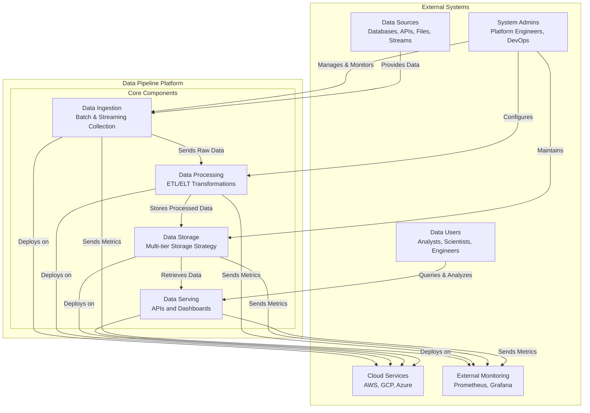

### Layered Architecture

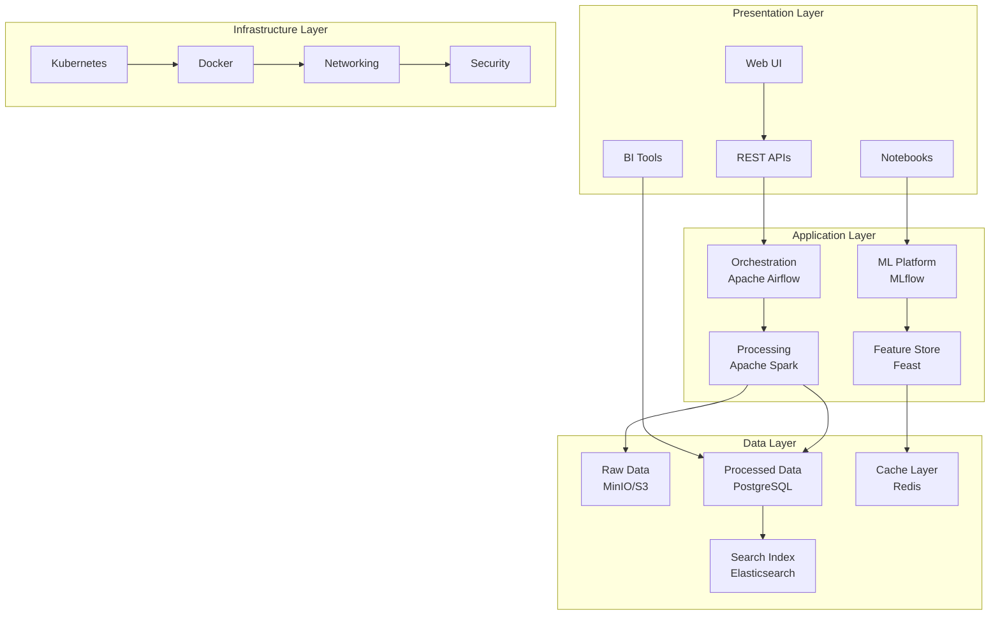

## Component Architecture

### Data Ingestion Components

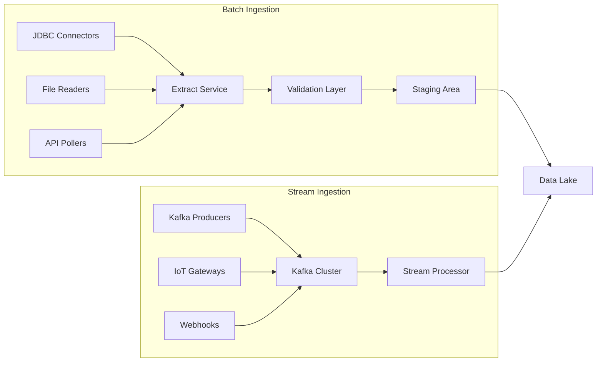

### Data Processing Architecture

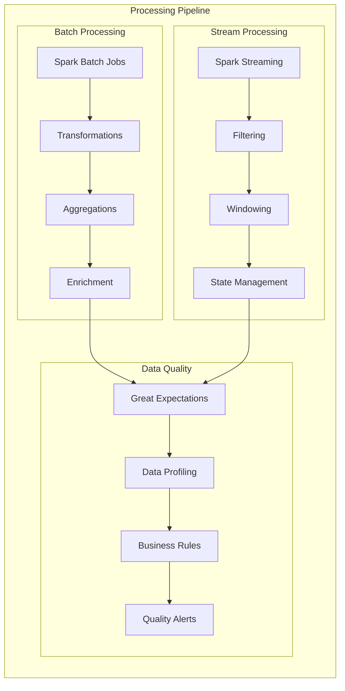

### Storage Architecture

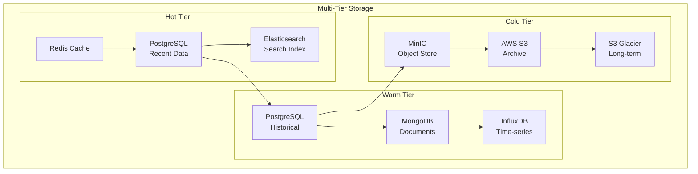

## Data Flow Architecture

### Batch Data Flow

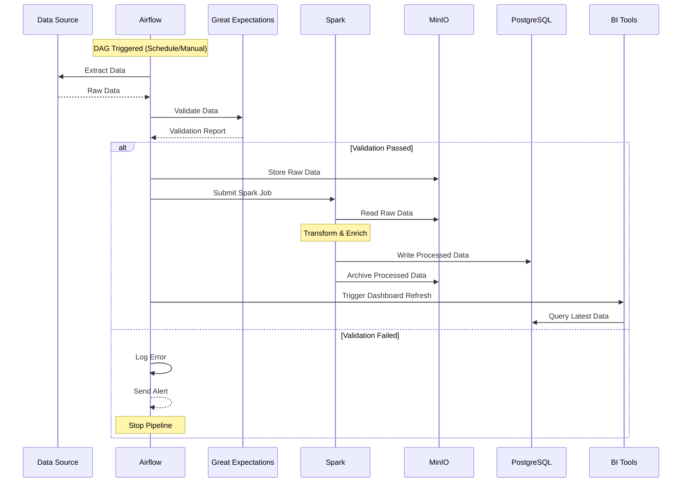

### Streaming Data Flow

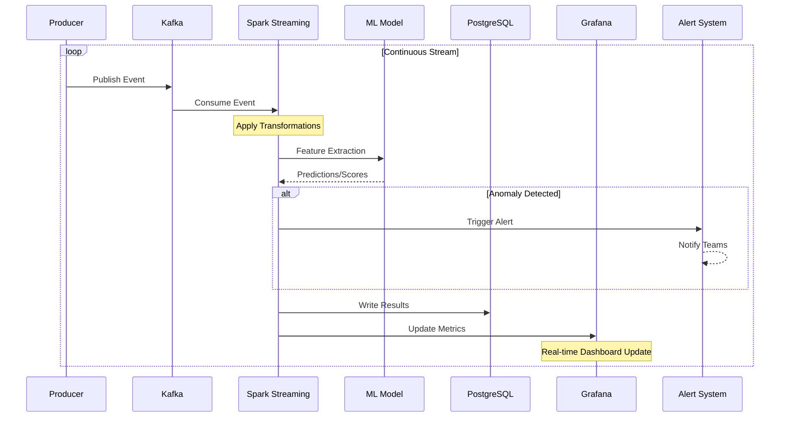

### Data Governance Flow

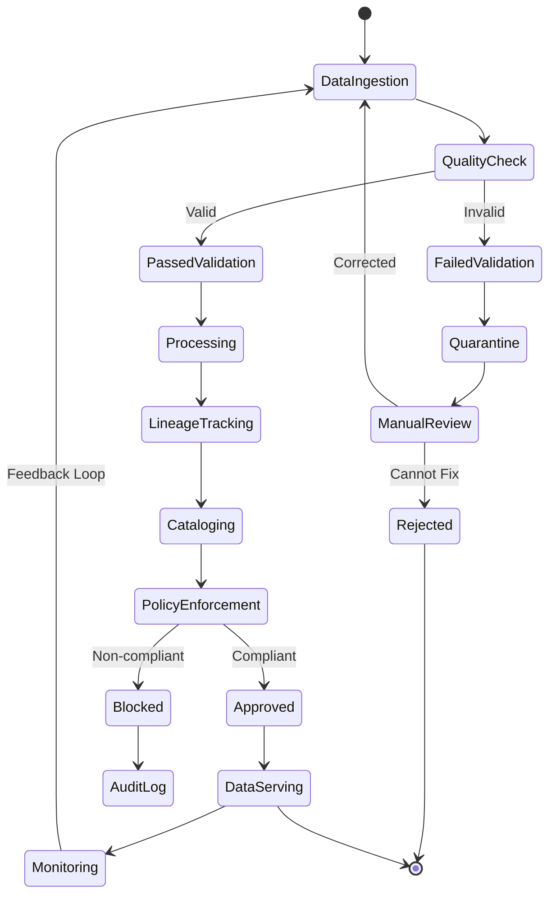

## Technology Stack

### Core Technologies

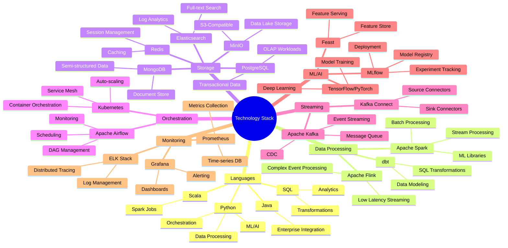

### Technology Decision Matrix

| Component | Technology | Rationale | Alternatives Considered |
|-----------|------------|-----------|------------------------|
| **Batch Processing** | Apache Spark | - Mature ecosystem<br/>- Unified batch/stream API<br/>- Strong ML support | Hadoop MapReduce, Apache Beam |
| **Stream Processing** | Spark Streaming | - Integration with batch<br/>- Exactly-once semantics<br/>- Micro-batch architecture | Apache Flink, Apache Storm |
| **Message Queue** | Apache Kafka | - High throughput<br/>- Durability<br/>- Stream replay capability | RabbitMQ, AWS Kinesis |
| **Orchestration** | Apache Airflow | - Rich UI<br/>- Extensive operators<br/>- Python-native | Prefect, Dagster, Luigi |
| **Object Storage** | MinIO | - S3-compatible<br/>- Self-hosted option<br/>- High performance | AWS S3, Azure Blob, GCS |
| **OLAP Database** | PostgreSQL | - SQL compliance<br/>- Extensions ecosystem<br/>- Cost-effective | Snowflake, ClickHouse, BigQuery |
| **Container Orchestration** | Kubernetes | - Industry standard<br/>- Cloud-agnostic<br/>- Rich ecosystem | Docker Swarm, Nomad |
| **Monitoring** | Prometheus + Grafana | - Open source<br/>- Kubernetes native<br/>- Flexible querying | DataDog, New Relic, CloudWatch |

## Deployment Architecture

### Kubernetes Deployment

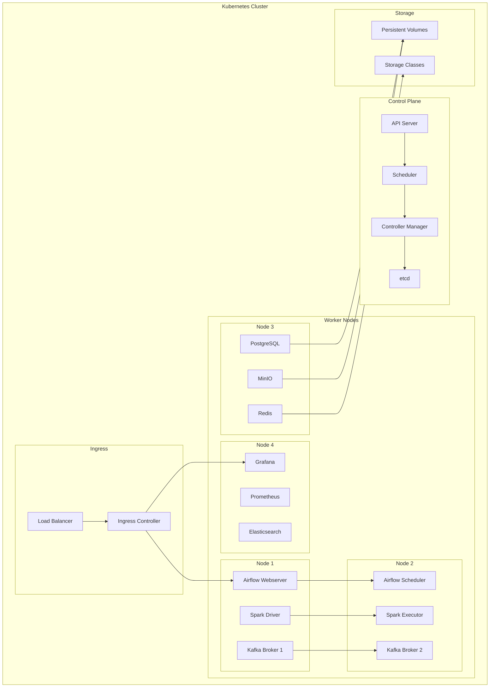

### CI/CD Pipeline

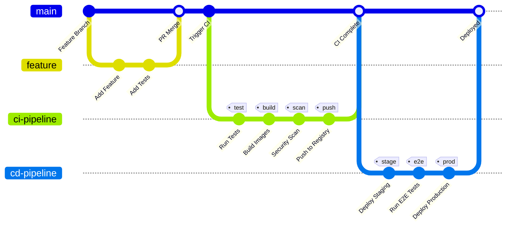

### Multi-Environment Architecture

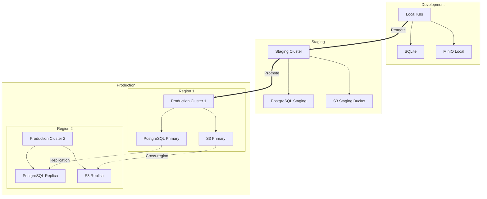

## Security Architecture

### Security Layers

```mermaid
graph TB
    subgraph "Security Architecture"
        subgraph "Network Security"
            FW[Firewall]
            WAF[Web Application Firewall]
            DDOS[DDoS Protection]
            VPN[VPN Gateway]
        end

        subgraph "Identity & Access"
            IAM[IAM Service]
            OAUTH[OAuth 2.0]
            RBAC[RBAC Policies]
            MFA[Multi-Factor Auth]
        end

        subgraph "Data Security"
            ENCRYPT_TRANSIT[Encryption in Transit]
            ENCRYPT_REST[Encryption at Rest]
            DLP[Data Loss Prevention]
            MASK[Data Masking]
        end

        subgraph "Application Security"
            SAST[SAST Scanning]
            DAST[DAST Testing]
            DEPEND[Dependency Scanning]
            SECRETS[Secrets Management]
        end

        subgraph "Compliance"
            AUDIT[Audit Logging]
            COMPLY[Compliance Monitoring]
            PRIVACY[Privacy Controls]
            RETAIN[Data Retention]
        end
    end

    FW --> WAF
    WAF --> DDOS
    DDOS --> VPN

    IAM --> OAUTH
    OAUTH --> RBAC
    RBAC --> MFA

    ENCRYPT_TRANSIT --> ENCRYPT_REST
    ENCRYPT_REST --> DLP
    DLP --> MASK

    SAST --> DAST
    DAST --> DEPEND
    DEPEND --> SECRETS

    AUDIT --> COMPLY
    COMPLY --> PRIVACY
    PRIVACY --> RETAIN
```

### Zero Trust Architecture

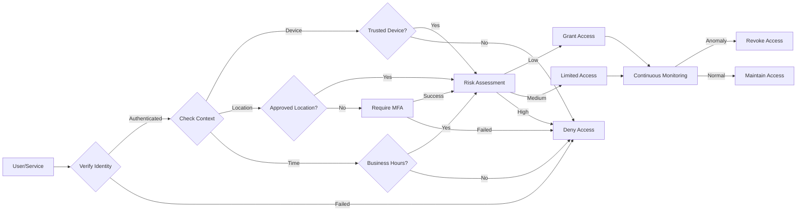

## Scalability & Performance

### Horizontal Scaling Strategy

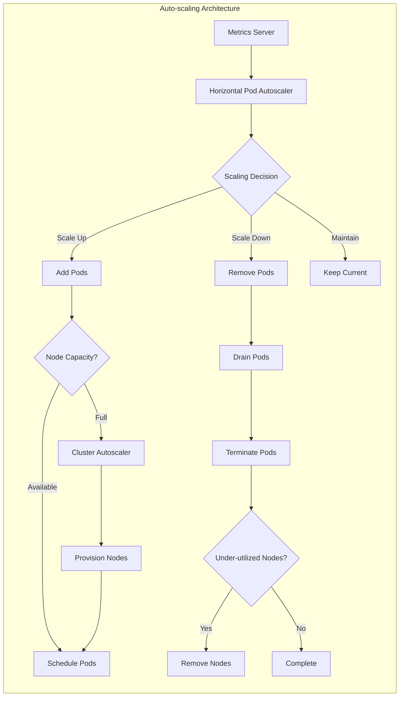

### Performance Optimization Layers

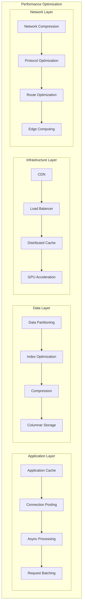

## Monitoring & Observability

### Observability Stack

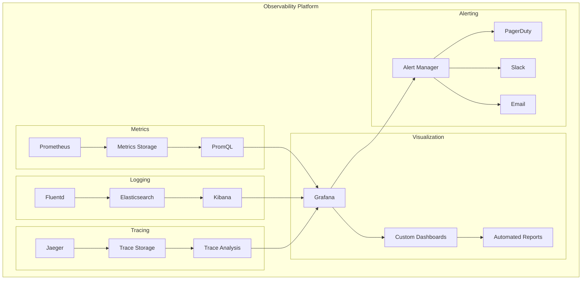

### SLI/SLO Architecture

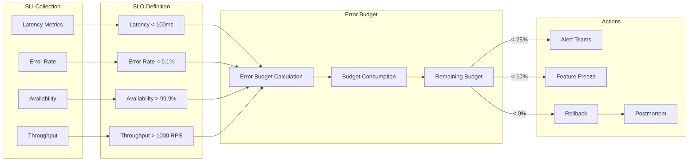

## Disaster Recovery

### Backup and Recovery Strategy

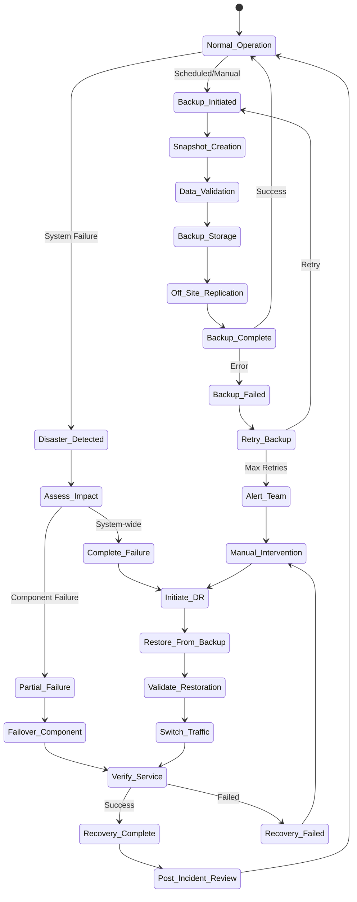

### RTO/RPO Strategy

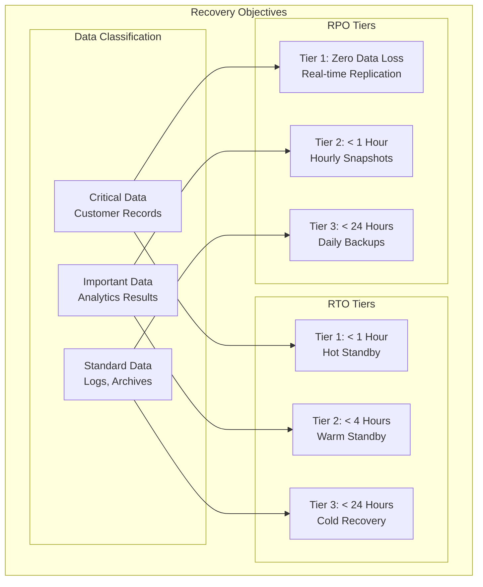

### Multi-Region Failover

```mermaid
sequenceDiagram
    participant Client
    participant DNS
    participant LB_Primary as Load Balancer (Primary)
    participant Region_A as Region A (Primary)
    participant Region_B as Region B (Standby)
    participant Health as Health Check
    participant Sync as Data Sync

    Note over Region_A, Region_B: Normal Operation

    loop Continuous
        Sync->>Region_A: Read Changes
        Sync->>Region_B: Replicate Data
        Health->>Region_A: Health Check
        Health->>Region_B: Health Check
    end

    Client->>DNS: Resolve Endpoint
    DNS->>Client: Primary Region IP
    Client->>LB_Primary: Request
    LB_Primary->>Region_A: Forward Request
    Region_A->>Client: Response

    Note over Region_A: Disaster Occurs

    Health->>Region_A: Health Check
    Region_A--xHealth: No Response
    Health->>Health: Mark Unhealthy
    Health->>DNS: Update DNS

    DNS->>DNS: Failover to Region B

    Client->>DNS: Resolve Endpoint
    DNS->>Client: Region B IP
    Client->>Region_B: Request
    Region_B->>Client: Response

    Note over Region_A: Recovery Process

    Region_A->>Health: Service Restored
    Health->>Region_A: Verify Health
    Health->>Sync: Initiate Sync
    Sync->>Region_B: Read Recent Changes
    Sync->>Region_A: Apply Changes

    Note over Region_A, Region_B: Failback (Optional)

    Health->>DNS: Update DNS
    DNS->>DNS: Route to Primary
```

## Conclusion

This architecture provides a robust, scalable, and maintainable foundation for enterprise-grade data processing. The modular design allows for independent scaling and evolution of components while maintaining system coherence through well-defined interfaces and protocols.

### Key Takeaways

1. **Modularity**: Each component can be developed, tested, and deployed independently
2. **Scalability**: Horizontal scaling at every layer ensures system can grow with demand
3. **Resilience**: Multiple layers of redundancy and failover mechanisms
4. **Observability**: Comprehensive monitoring and logging at all levels
5. **Security**: Defense in depth with multiple security layers
6. **Flexibility**: Technology choices can be adapted based on specific requirements

### Next Steps

- Review and customize the architecture based on specific organizational needs
- Conduct proof of concept for critical components
- Develop detailed implementation plans for each subsystem
- Establish governance and operational procedures
- Create runbooks for common operational scenarios

---

For more information, see:
- [README.md](README.md) - Project overview and setup instructions
- [CONTRIBUTING.md](.github/CONTRIBUTING.md) - Contribution guidelines
- [Docker Documentation](docker-compose.yaml) - Service configurations
- [Kubernetes Manifests](kubernetes/) - Deployment specifications
