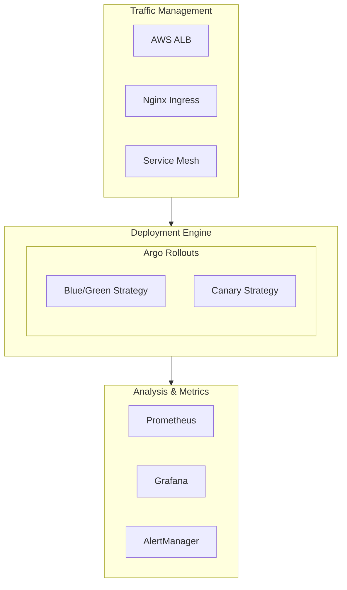
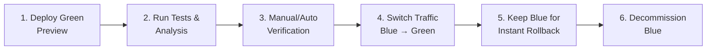
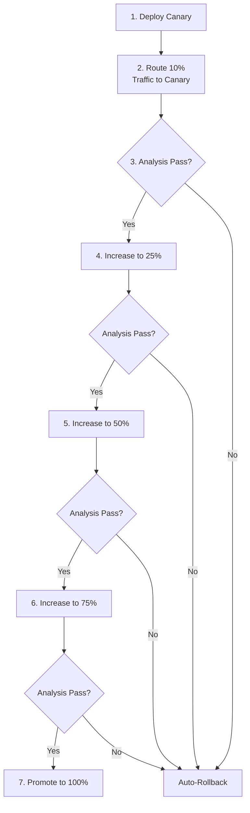

# Advanced Deployment Strategies Guide

This guide covers the advanced deployment strategies implemented for the E2E Data Pipeline, including Blue/Green deployments, Canary deployments, and progressive delivery patterns.

## Table of Contents

1. [Overview](#overview)
2. [Architecture](#architecture)
3. [Prerequisites](#prerequisites)
4. [Installation](#installation)
5. [Deployment Strategies](#deployment-strategies)
6. [Monitoring & Observability](#monitoring--observability)
7. [Troubleshooting](#troubleshooting)
8. [Best Practices](#best-practices)

---

## Overview

### What's New

This project now includes enterprise-grade deployment capabilities:

- **Blue/Green Deployments**: Zero-downtime deployments with instant rollback capability
- **Canary Deployments**: Progressive traffic shifting with automated analysis
- **Automated Analysis**: Prometheus-based metrics analysis during deployments
- **Traffic Management**: Advanced routing with AWS ALB and Nginx Ingress
- **Monitoring**: Real-time deployment metrics and dashboards
- **GitOps Integration**: Argo CD with Argo Rollouts for continuous delivery

### Key Benefits

- **Zero Downtime**: All deployment strategies ensure no service interruption
- **Risk Mitigation**: Progressive rollouts and automated rollbacks reduce deployment risk
- **Automated Quality Gates**: Analysis templates validate deployments before promotion
- **Visibility**: Comprehensive monitoring and alerting for deployment health
- **Speed**: Faster rollbacks and controlled traffic shifting

---

## Architecture

### Components



### Deployment Flow

#### Blue/Green Deployment



#### Canary Deployment



---

## Prerequisites

### Required Tools

- **kubectl** (v1.24+)
- **helm** (v3.10+)
- **AWS CLI** (v2.0+) - for AWS deployments
- **eksctl** (optional) - for EKS management
- **jq** (optional) - for JSON parsing

### Kubernetes Cluster

- **Kubernetes**: v1.24+
- **Minimum Nodes**: 3
- **Node Size**: t3.medium or larger
- **Storage**: Support for dynamic PVC provisioning

### AWS Resources (for AWS deployments)

- EKS Cluster
- VPC with public/private subnets
- IAM roles for service accounts
- ACM certificate (for HTTPS)

---

## Installation

### Quick Start

```bash
# 1. Navigate to scripts directory
cd scripts

# 2. Make scripts executable
chmod +x *.sh

# 3. Run setup script
./setup-advanced-deployments.sh

# 4. Verify installation
kubectl get pods -n argo-rollouts
kubectl get pods -n monitoring
```

### Manual Installation

#### 1. Install Argo Rollouts

```bash
kubectl create namespace argo-rollouts
kubectl apply -n argo-rollouts -f \
  https://github.com/argoproj/argo-rollouts/releases/latest/download/install.yaml

# Install kubectl plugin
curl -LO https://github.com/argoproj/argo-rollouts/releases/latest/download/kubectl-argo-rollouts-linux-amd64
chmod +x kubectl-argo-rollouts-linux-amd64
sudo mv kubectl-argo-rollouts-linux-amd64 /usr/local/bin/kubectl-argo-rollouts
```

#### 2. Install Prometheus & Grafana

```bash
helm repo add prometheus-community https://prometheus-community.github.io/helm-charts
helm repo update

helm install kube-prometheus prometheus-community/kube-prometheus-stack \
  --namespace monitoring \
  --create-namespace \
  --set prometheus.prometheusSpec.serviceMonitorSelectorNilUsesHelmValues=false
```

#### 3. Install Nginx Ingress (Optional)

```bash
helm repo add ingress-nginx https://kubernetes.github.io/ingress-nginx
helm install ingress-nginx ingress-nginx/ingress-nginx \
  --namespace ingress-nginx \
  --create-namespace
```

#### 4. Apply Kubernetes Manifests

```bash
cd kubernetes

# Apply services
kubectl apply -f services.yaml

# Apply analysis templates
kubectl apply -f analysis-templates.yaml

# Apply ServiceMonitors
kubectl apply -f servicemonitors.yaml

# Apply Ingress
kubectl apply -f ingress.yaml
```

---

## Deployment Strategies

### Blue/Green Deployment

#### Deploy with Script

```bash
cd scripts
./deploy-blue-green.sh airflow v1.0.0
```

#### Manual Deployment

```bash
# Apply rollout manifest
kubectl apply -f kubernetes/rollout-blue-green.yaml

# Update image
kubectl argo rollouts set image airflow-rollout \
  airflow-webserver=myrepo/airflow-pipeline:v1.0.0

# Check status
kubectl argo rollouts get rollout airflow-rollout --watch

# Promote to production
kubectl argo rollouts promote airflow-rollout

# Rollback if needed
kubectl argo rollouts abort airflow-rollout
kubectl argo rollouts undo airflow-rollout
```

#### Access Preview Environment

```bash
# Port-forward to preview service
kubectl port-forward svc/airflow-webserver-preview 8081:8080

# Test preview
curl http://localhost:8081/health
```

### Canary Deployment

#### Deploy with Script

```bash
cd scripts
./deploy-canary.sh airflow v1.0.0
```

#### Manual Deployment

```bash
# Apply rollout manifest
kubectl apply -f kubernetes/rollout-canary.yaml

# Update image (triggers canary)
kubectl argo rollouts set image airflow-canary-rollout \
  airflow-webserver=myrepo/airflow-pipeline:v1.0.0

# Monitor progress
kubectl argo rollouts get rollout airflow-canary-rollout --watch

# Manual promotion (if not using auto-promotion)
kubectl argo rollouts promote airflow-canary-rollout

# Abort and rollback
kubectl argo rollouts abort airflow-canary-rollout
```

#### Canary Traffic Weights

The default canary strategy uses progressive traffic shifting:
- **Step 1**: 10% for 2 minutes
- **Step 2**: 25% for 3 minutes
- **Step 3**: 50% for 5 minutes
- **Step 4**: 75% for 3 minutes
- **Step 5**: 100% (full promotion)

Each step includes automated analysis. Deployment auto-aborts on analysis failure.

### Header-Based Canary (A/B Testing)

```bash
# Apply header-based canary
kubectl apply -f kubernetes/rollout-canary.yaml

# Access canary version with header
curl -H "X-Version: canary" http://your-domain.com

# Regular traffic goes to stable version
curl http://your-domain.com
```

---

## Monitoring & Observability

### Access Dashboards

#### Argo Rollouts Dashboard

```bash
kubectl port-forward -n argo-rollouts svc/argo-rollouts-dashboard 3100:3100
# Open: http://localhost:3100
```

#### Grafana

```bash
kubectl port-forward -n monitoring svc/kube-prometheus-grafana 3000:80
# Open: http://localhost:3000
# Username: admin
# Password: admin
```

#### Prometheus

```bash
kubectl port-forward -n monitoring svc/kube-prometheus-prometheus 9090:9090
# Open: http://localhost:9090
```

### Import Grafana Dashboard

```bash
# The dashboard is located at: monitoring/grafana-deployment-dashboards.json

# Import via UI:
# 1. Login to Grafana
# 2. Click "+" → Import
# 3. Upload the JSON file
# 4. Select Prometheus data source
# 5. Click Import
```

### Key Metrics

#### Success Rate
```promql
sum(rate(http_requests_total{status=~"2.."}[5m])) /
sum(rate(http_requests_total[5m]))
```

#### Error Rate
```promql
sum(rate(http_requests_total{status=~"5.."}[5m])) /
sum(rate(http_requests_total[5m]))
```

#### P95 Latency
```promql
histogram_quantile(0.95,
  sum(rate(http_request_duration_milliseconds_bucket[5m])) by (le)
)
```

### Alerts

Alerts are automatically configured for:

- High error rate (>5%)
- High latency (P95 >1000ms)
- Rollout degraded
- Analysis run failed
- Airflow task failures
- Kafka consumer lag
- Spark job failures

Configure Slack notifications in `kubernetes/argo-rollouts-install.yaml`.

---

## Troubleshooting

### Rollout Stuck in Progressing

```bash
# Check rollout status
kubectl argo rollouts get rollout <rollout-name>

# Check analysis runs
kubectl get analysisruns

# View analysis details
kubectl describe analysisrun <analysis-run-name>

# Check pod status
kubectl get pods -l app=pipeline

# View pod logs
kubectl logs <pod-name>
```

### Analysis Failing

```bash
# Check Prometheus connectivity
kubectl exec -it <rollout-pod> -- curl http://prometheus:9090/-/healthy

# Verify metrics exist
kubectl port-forward svc/prometheus 9090:9090
# Open Prometheus UI and run query

# Check ServiceMonitors
kubectl get servicemonitors

# View analysis template
kubectl get analysistemplate <template-name> -o yaml
```

### Canary Not Receiving Traffic

```bash
# Check services
kubectl get svc

# Check ingress
kubectl get ingress
kubectl describe ingress <ingress-name>

# Verify canary service selector
kubectl get svc <canary-service> -o yaml

# Check pod labels
kubectl get pods --show-labels
```

### Rollback

```bash
# Abort current rollout
kubectl argo rollouts abort <rollout-name>

# Undo to previous version
kubectl argo rollouts undo <rollout-name>

# Undo to specific revision
kubectl argo rollouts undo <rollout-name> --to-revision=2
```

---

## Best Practices

### Deployment Strategy Selection

| Scenario | Recommended Strategy |
|----------|---------------------|
| Critical production service | Blue/Green |
| High-traffic service | Canary |
| Testing new features | Canary with header routing |
| Database migrations | Blue/Green |
| Quick iterations | Canary |
| Stateful applications | Blue/Green |

### Analysis Configuration

1. **Set appropriate thresholds**: Don't make them too strict or too loose
2. **Use multiple metrics**: Success rate + latency + errors
3. **Set failure limits**: Allow 2-3 failures before aborting
4. **Adjust intervals**: 30s for high-traffic, 60s for low-traffic

### Traffic Management

1. **Start with small percentages**: 10% for initial canary
2. **Increase gradually**: 10% → 25% → 50% → 75% → 100%
3. **Allow soak time**: Minimum 2-5 minutes per step
4. **Monitor continuously**: Watch metrics during traffic shifts

### Rollback Strategy

1. **Set auto-rollback**: Configure analysis to auto-abort on failures
2. **Keep blue/green environments**: Maintain for quick rollback
3. **Test rollback procedures**: Practice rollbacks regularly
4. **Document rollback playbooks**: Clear steps for emergencies

### Security

1. **Use RBAC**: Limit who can promote deployments
2. **Require approvals**: Manual gates for production
3. **Audit trails**: Track all deployment actions
4. **Network policies**: Isolate preview environments

---

## Advanced Features

### Progressive Experiments

Test multiple versions simultaneously:

```yaml
experiments:
  - name: version-comparison
    templates:
      - name: v1
        specRef: stable
        replicas: 2
      - name: v2
        specRef: canary
        replicas: 2
    duration: 10m
```

### Custom Analysis Providers

Beyond Prometheus, support for:
- Datadog
- New Relic
- CloudWatch
- Custom webhooks

### Notification Integrations

Configure in `kubernetes/argo-rollouts-install.yaml`:
- Slack
- Email
- PagerDuty
- Webhooks

---

## Terraform Deployment

### Initialize Infrastructure

```bash
cd terraform

# Initialize
terraform init

# Plan
terraform plan

# Apply
terraform apply

# Outputs
terraform output
```

### Key Resources

- **EKS Cluster**: `eks.tf`
- **Load Balancer Controller**: `load-balancer-controller.tf`
- **Argo Rollouts**: `argo-rollouts.tf`
- **Networking**: `security.tf`

---

## References

### Documentation

- [Argo Rollouts](https://argoproj.github.io/argo-rollouts/)
- [AWS Load Balancer Controller](https://kubernetes-sigs.github.io/aws-load-balancer-controller/)
- [Prometheus Operator](https://prometheus-operator.dev/)
- [Grafana](https://grafana.com/docs/)

### Files Reference

| File | Purpose |
|------|---------|
| `kubernetes/rollout-blue-green.yaml` | Blue/Green deployment manifests |
| `kubernetes/rollout-canary.yaml` | Canary deployment manifests |
| `kubernetes/analysis-templates.yaml` | Prometheus analysis templates |
| `kubernetes/services.yaml` | Kubernetes services |
| `kubernetes/ingress.yaml` | Ingress configurations |
| `kubernetes/servicemonitors.yaml` | Prometheus ServiceMonitors |
| `scripts/deploy-blue-green.sh` | Blue/Green deployment script |
| `scripts/deploy-canary.sh` | Canary deployment script |
| `scripts/setup-advanced-deployments.sh` | Infrastructure setup |
| `terraform/load-balancer-controller.tf` | AWS LB Controller |
| `terraform/argo-rollouts.tf` | Argo Rollouts infrastructure |

---

## Support

For issues or questions:
1. Check the troubleshooting section
2. Review Argo Rollouts documentation
3. Check pod logs and events
4. Verify Prometheus metrics

---

**Last Updated**: 2025-11-27
**Version**: 1.0.0
